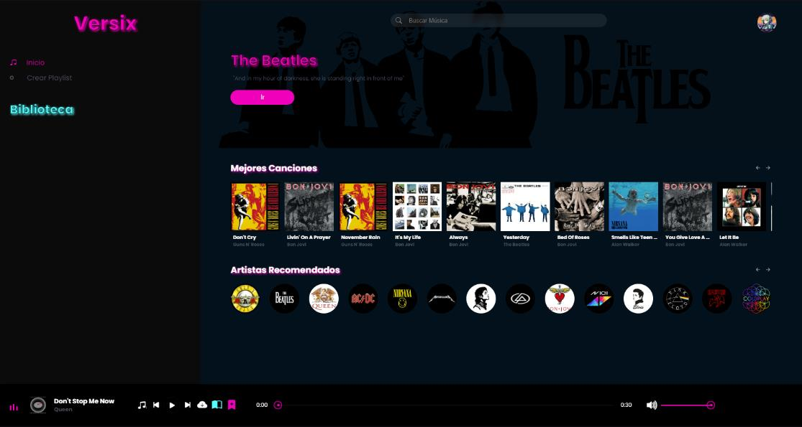
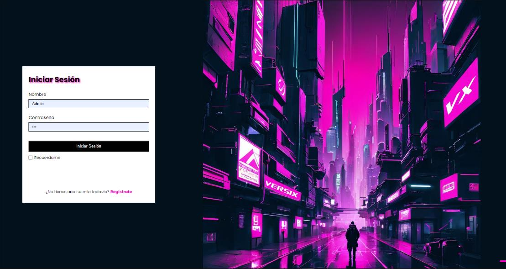
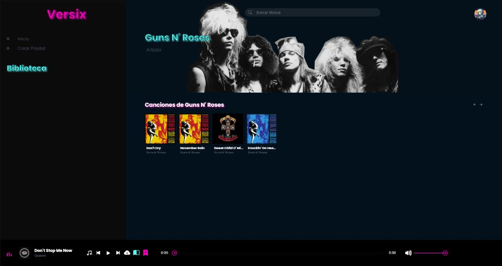
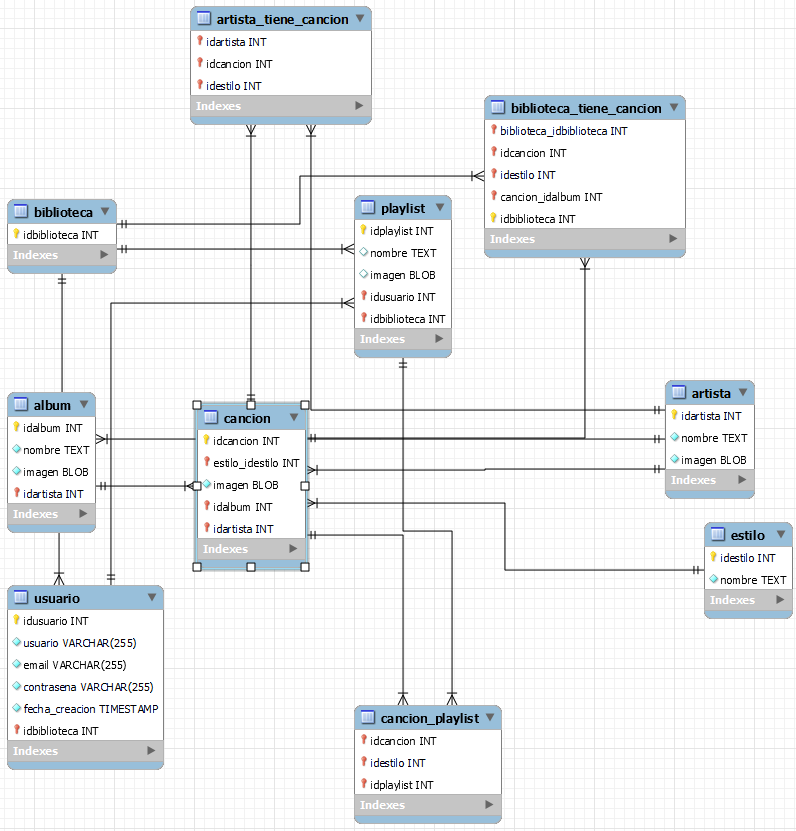

<div align="center">

# VERSIX

### Tu música. Tu biblioteca. Tus playlists.

Aplicación web de reproducción musical desarrollada desde cero con **PHP, JavaScript y MySQL**.

**Proyecto individual · TFG de Desarrollo de Aplicaciones Web · 2024**

[](https://github.com/Daviddv07/versix/actions/workflows/checks.yml)

[Explorar el proyecto](#el-proyecto) · [Funcionalidades](#funcionalidades) · [Capturas](#capturas) · [Instalación](#puesta-en-marcha-local)

</div>



*Captura del TFG original (2024). La edición de portfolio utiliza un catálogo sintético y adapta las pantallas; no es una captura de esa nueva edición.*

## El proyecto

Versix nace de mi interés por la música y el desarrollo web. Lo creé como proyecto final del ciclo superior de Desarrollo de Aplicaciones Web para reunir, en una misma aplicación, un catálogo musical, un reproductor y una biblioteca personal.

**Diseñé y desarrollé el proyecto original de forma individual y desde cero**, desde la interfaz y el modelo de datos hasta la lógica del servidor y la documentación. La entrega original es de abril de 2024.

Esta edición incorpora mejoras posteriores preparadas con asistencia de Codex en septiembre de 2026. La autoría y evolución se detallan en [Origen y cambios](docs/ORIGEN-Y-CAMBIOS.md).

## Funcionalidades

| Área | Funcionalidades implementadas en el código original |
| --- | --- |
| Reproductor | Reproducción y pausa, control de volumen, avance temporal y cambio de canción. |
| Modos de escucha | Reproducción secuencial, aleatoria y en bucle. |
| Búsqueda | Búsqueda de canciones y artistas desde la interfaz. |
| Biblioteca | Incorporación de canciones a la biblioteca del usuario. |
| Playlists | Creación con nombre e imagen e incorporación de canciones. |
| Usuarios | Registro e inicio de sesión con PHP y sesiones. |
| Artistas | Páginas dedicadas con su selección musical. |

La reproducción utiliza archivos de audio servidos por la aplicación y la API de audio del navegador. No requiere una conexión con Spotify ni una API musical externa.

## Tecnologías

| Capa | Tecnologías y herramientas |
| --- | --- |
| Interfaz | HTML5, CSS3 y JavaScript. La entrega original utilizaba Bootstrap Icons. |
| Servidor | PHP, MySQLi y sesiones. |
| Datos | MySQL; modelo relacional con 10 tablas. |
| Comunicación | JSON y Fetch API en esta edición; XMLHttpRequest en el original. |
| Entorno de desarrollo original | Windows, XAMPP, Apache y Visual Studio Code. |

## Mi aportación

- **Interfaz:** diseño oscuro con acentos magenta y cian, navegación, catálogo y reproductor integrado.
- **Lógica del cliente:** controles de audio, búsqueda e interacción con biblioteca y playlists.
- **Backend:** formularios de registro y acceso, consultas a MySQL y operaciones sobre la colección musical.
- **Modelo de datos:** entidades y relaciones para usuarios, bibliotecas, playlists, canciones, artistas, álbumes y estilos.
- **Proceso:** desarrollo incremental, organización mediante Kanban y pruebas manuales documentadas.
- **Documentación:** memoria del proyecto, diagramas, manual de usuario e instrucciones de instalación.

## Capturas

Capturas de la versión original incluidas en la memoria del TFG.

### Acceso a la aplicación



### Página de artista



## Modelo de datos

Se conservan las **10 entidades/tablas** del modelo original, simplificando claves y relaciones para esta edición: `usuario`, `biblioteca`, `playlist`, `cancion`, `artista`, `album`, `estilo`, `biblioteca_tiene_cancion`, `cancion_playlist` y `artista_tiene_cancion`.



*Diagrama histórico del TFG. Para la estructura exacta actual, consulta [database/schema.sql](database/schema.sql).*

## Puesta en marcha local

Necesitas Docker con Compose y Python 3. Desde la raíz del repositorio:

```bash
python scripts/setup_local.py
docker compose up --build -d
```

Abre **http://localhost:8080** y crea tu propia cuenta. No se incluyen usuarios ni contraseñas predeterminadas.

Consulta [la instalación paso a paso y la alternativa con XAMPP](docs/INSTALACION.md).

## Pruebas y estado

```bash
node --test tests/player.test.cjs
python tests/smoke.py http://127.0.0.1:8080
```

- **Validado en GitHub Actions:** construcción Docker, arranque de PHP y MySQL, sintaxis de 17 archivos PHP, cuatro pruebas del reproductor y veinte comprobaciones HTTP de registro, sesión, biblioteca, playlists y permisos.
- **Validado localmente:** sintaxis JavaScript y comprobaciones de recursos y documentación.
- **Pendiente:** revisión visual de la nueva interfaz y pruebas de reproducción real en navegador.
- [Primera ejecución completada correctamente](https://github.com/Daviddv07/versix/actions/runs/35617719652), sobre el commit `4155e3a`.

Esta entrega es un **proyecto académico con pruebas automatizadas**, no una demo web alojada ni un servicio listo para producción. Los resultados y límites se detallan en [PRUEBAS.md](docs/PRUEBAS.md).

## Mejoras de esta edición

- Contraseñas con hash y regeneración de la sesión tras la autenticación.
- Consultas preparadas, tokens CSRF y comprobación del propietario de las playlists.
- Recodificación de portadas, límites de tamaño y almacenamiento fuera del directorio público.
- Configuración local excluida de Git y eliminación de datos personales del catálogo.
- Catálogo JSON sin modificar archivos JavaScript en el servidor.
- Corrección de índices del reproductor, rutas relativas y estados de error visibles.
- Seis audios sintéticos, portadas SVG y artistas ficticios generados para la demostración.

## Evolución futura

La memoria original propone recomendaciones musicales, funciones sociales y contenido de radio o pódcast. Son ideas futuras, no funcionalidades implementadas.

## Autor

**David Díaz Vílchez** · Técnico Superior en Desarrollo de Aplicaciones Web

[Perfil de GitHub](https://github.com/Daviddv07)

Proyecto original individual (2024). Preparación de esta edición con asistencia de Codex (2026). Consulta [las notas de recursos y atribución](docs/RECURSOS.md).
